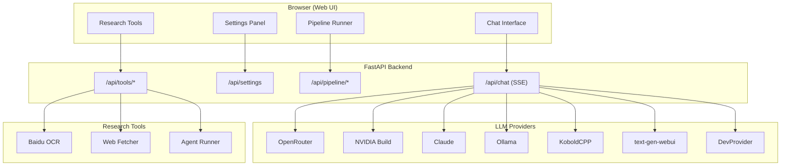

# Collabuild MAS v0.3

Multi-Agent System with a KoboldCPP-style web UI. Chat with AI models running locally or via cloud APIs — OpenRouter, NVIDIA Build, Anthropic Claude, Ollama, KoboldCPP, text-generation-webui, and any OpenAI-compatible endpoint. Includes a 9-stage research paper to production pipeline with full dev fallback for offline testing.

**Author:** [Sai Karun Nandipati](https://karun99.github.io)

[](https://github.com/karun99/Collabuild/actions/workflows/ci.yml)
[](https://www.python.org/downloads/)
[](LICENSE)

---

## Architecture

See [UML.md](UML.md) for all Mermaid diagrams (13 diagrams including class hierarchy, sequence diagrams, deployment, and more).



---

## Installation

### Prerequisites

- **Python 3.10+** (check: `python3 --version`)
- **pip** (check: `pip --version`)
- **Git** (check: `git --version`)

### From PyPI (when published)

```bash
pip install collabuild-mas[web]
```

### From Source (Recommended)

```bash
# Clone the repository
git clone https://github.com/karun99/Collabuild.git
cd Collabuild

# Create a virtual environment (recommended)
python3 -m venv .venv
source .venv/bin/activate        # Linux / macOS
# .venv\Scripts\activate         # Windows (PowerShell)
# .venv\Scripts\activate.bat     # Windows (cmd)

# Install in editable mode with all extras
pip install -e ".[web,dev,all]"
```

### Docker

```bash
# Build the image
docker build -t collabuild-mas .

# Run with docker-compose (recommended)
cp .env.example .env              # Set your API keys in .env
docker compose up -d

# Or run standalone
docker run -p 8080:8080 \
  -e OPENROUTER_API_KEY=sk-or-... \
  collabuild-mas
```

### Quick Verify

```bash
# Should print "0.3.0"
python3 -c "import collabuild; print(collabuild.__version__)"

# Run tests
pytest tests/ -v

# Lint
ruff check collabuild/

# Format check
ruff format --check collabuild/
```

---

## Quick Start

### 1. Launch the Web UI

```bash
collabuild web                    # default: http://127.0.0.1:8080
collabuild web --port 3000        # custom port
collabuild web --host 0.0.0.0     # bind all interfaces
collabuild web --reload           # auto-reload on code changes
collabuild web --dev              # offline dev mode (no API key needed)
```

### 2. Open in Browser

Navigate to `http://127.0.0.1:8080`

### 3. Configure a Provider

In the sidebar, select a provider and enter your settings:

| Provider | What you need | Free Tier |
|----------|--------------|-----------|
| **OpenRouter** | API key from [openrouter.ai](https://openrouter.ai) | Yes |
| **NVIDIA Build** | API key from [build.nvidia.com](https://build.nvidia.com) | Yes |
| **Claude** | API key from [console.anthropic.com](https://console.anthropic.com) | No |
| **Ollama** | Run `ollama serve` locally (auto-detected) | Yes (local) |
| **KoboldCPP** | Run KoboldCPP server locally (port 5001) | Yes (local) |
| **text-gen-webui** | Run oobabooga locally (port 5000) | Yes (local) |
| **Dev** | No API key needed (offline mock) | Yes |

### 4. Start Chatting

Select a model and type your message. Responses stream in real-time.

---

## CLI Usage

```bash
# Web UI
collabuild web
collabuild web --dev                              # offline mode

# Pipeline via CLI
collabuild --dev                                  # run full pipeline offline
collabuild --provider ollama --model llama3.1
collabuild --provider openrouter --paper-file paper.txt --output report.md
collabuild --provider nvidia --api-key $NVIDIA_API_KEY --paper "My paper..."

# All flags
collabuild --provider {openrouter,nvidia,claude,ollama,koboldcpp,textgen,dev}
collabuild --model <model-name>
collabuild --api-key <key>
collabuild --endpoint <url>
collabuild --paper <text>
collabuild --paper-file <path>
collabuild --output <path>           # default: pipeline_report.md
collabuild --config <config.yaml>    # default: bundled config
```

---

## Supported Providers

### OpenRouter

- **Endpoint:** `https://openrouter.ai/api/v1`
- **Auth:** `OPENROUTER_API_KEY` env var
- **Models:** Auto-fetched (200+ models: gpt-4o, claude-3.5, llama-3.1, mixtral, gemma, etc.)
- **Streaming:** Full SSE support

### NVIDIA Build

- **Endpoint:** `https://integrate.api.nvidia.com/v1`
- **Auth:** `NVIDIA_API_KEY` env var
- **Models:** Llama 3.1, Nemotron, Mixtral, Gemma, CodeLlama, Phi-3, StarCoder
- **Streaming:** Full SSE support

### Anthropic Claude

- **Endpoint:** `https://api.anthropic.com/v1`
- **Auth:** `ANTHROPIC_API_KEY` env var
- **Models:** claude-opus-4-8, claude-sonnet-4-20250514, claude-haiku-4-5-20251001
- **Streaming:** SSE support

### Ollama (Local)

```bash
curl -fsSL https://ollama.com/install.sh | sh    # install
ollama pull llama3.1                               # pull model
ollama serve                                       # start server
```

- **Endpoint:** `http://localhost:11434`
- **Auth:** None required

### KoboldCPP (Local)

```bash
# Download: https://github.com/LostRuins/koboldcpp
./koboldcpp --model ~/models/llama-3.1-8b-instruct.Q4_K_M.gguf --port 5001
```

- **Endpoint:** `http://localhost:5001`

### text-generation-webui (Local)

```bash
# https://github.com/oobabooga/text-generation-webui
python server.py --api --listen --port 5000
```

- **Endpoint:** `http://localhost:5000`

---

## Configuration

### Environment Variables

```bash
# Copy the example and fill in your keys
cp .env.example .env
```

| Variable | Provider | Description |
|----------|----------|-------------|
| `OPENROUTER_API_KEY` | OpenRouter | API key |
| `NVIDIA_API_KEY` | NVIDIA Build | API key |
| `ANTHROPIC_API_KEY` | Claude | API key |
| `BAIDU_OCR_API_KEY` | Baidu OCR | API key |
| `BAIDU_OCR_SECRET_KEY` | Baidu OCR | Secret key |

### config.yaml

Located at project root. Defines provider defaults and pipeline settings. Supports `${ENV_VAR}` substitution.

---

## Pipeline

The 9-stage research paper to production pipeline:

| # | Stage | Agent | Description |
|---|-------|-------|-------------|
| 1 | Paper Analysis | PaperAnalyzer | Extract methodology, algorithms, architecture |
| 2 | SRS Generation | SRSGenerator | IEEE 830 Software Requirements Specification |
| 3 | Module Design | ModuleDesigner | Module decomposition with interfaces |
| 4 | User Flow Design | UserFlowDesigner | UX flows with sequence diagrams |
| 5 | SDLC Plan | SDLCPlanner | Sprint breakdown, milestones, timeline |
| 6 | Code Generation | CodeGenerator | Production-ready implementation code |
| 7 | Debugging & Review | Debugger | Bug/security/performance review |
| 8 | Deployment Plan | DeploymentPlanner | Infrastructure, CI/CD, monitoring |
| 9 | Final Review | FinalReviewer | QA validation |

Each stage generates Mermaid diagrams. Run offline with `collabuild --dev`.

---

## API Reference

| Endpoint | Method | Description |
|----------|--------|-------------|
| `/api/chat` | POST | Streaming chat (SSE) |
| `/api/chat/sync` | POST | Non-streaming chat |
| `/api/settings` | GET/POST | Get/save settings |
| `/api/models` | GET | List provider models |
| `/api/local-models` | GET | Scan for .gguf/.ggml files |
| `/api/providers/status` | GET | Check local provider status |
| `/api/pipeline/run` | POST | Start pipeline run |
| `/api/pipeline/{run_id}` | GET | Get run status |
| `/api/pipeline/{run_id}/stream` | GET | SSE progress stream |
| `/api/tools/ocr` | POST | OCR a document |
| `/api/tools/web-fetch` | POST | Fetch URL content |
| `/api/tools/agent-run` | POST | Run research agent |

---

## UML Diagrams

See [UML.md](UML.md) for all 13 architecture diagrams:

1. System Architecture
2. Provider Class Hierarchy
3. 9-Stage Pipeline Flow
4. Chat API Sequence Diagram
5. Provider Selection Sequence
6. Multi-Agent System Class Diagram
7. Pipeline Stage Agent Flow
8. Web Application Deployment
9. Research Agent Loop
10. OCR Document Processing
11. Configuration Resolution
12. CI/CD Pipeline
13. Module Decomposition

---

## File Structure

```
Collabuild/
├── collabuild/
│   ├── __init__.py          # Package exports (v0.3.0)
│   ├── __main__.py          # CLI entry point
│   ├── config.py            # YAML config + env var resolution
│   ├── providers.py         # LLM providers (7+)
│   ├── mas.py               # Multi-Agent System (Agent, Crew, Task)
│   ├── pipeline.py          # 9-stage pipeline
│   ├── ocr/baidu_ocr.py     # Baidu OCR (Unlimited + General)
│   ├── research/
│   │   ├── web_fetcher.py   # URL fetching + text extraction
│   │   └── agent_runner.py  # Autonomous research agent
│   └── web/
│       ├── app.py           # FastAPI routes + API
│       └── templates/       # HTML templates (Tokyo Night theme)
├── tests/                   # Test suite
├── diagrams/                # Individual Mermaid diagram files
├── .github/workflows/ci.yml # CI/CD pipeline
├── config.yaml              # Default configuration
├── pyproject.toml           # Build config + metadata
├── Dockerfile               # Multi-stage Docker build
├── docker-compose.yml       # Docker Compose config
├── UML.md                   # All architecture diagrams
├── LICENSE                  # MIT License
├── CONTRIBUTING.md          # Contribution guide
├── CODE_OF_CONDUCT.md       # Community standards
└── SECURITY.md              # Security policy
```

---

## Development

```bash
# Install with dev extras
pip install -e ".[web,dev,all]"

# Run tests
pytest tests/ -v

# Lint
ruff check collabuild/

# Auto-fix + format
ruff check collabuild/ --fix
ruff format collabuild/

# Dev mode (offline, no API key)
collabuild --dev
collabuild web --dev --reload
```

---

## Deployment

### Docker Compose (Recommended)

```bash
cp .env.example .env
# Edit .env with your API keys
docker compose up -d
```

### Manual

```bash
pip install -e ".[web]"
collabuild web --host 0.0.0.0 --port 8080
```

### CI/CD

Push to `main` or create a version tag to trigger GitHub Actions:

```bash
git tag v0.3.0
git push origin v0.3.0    # Triggers PyPI publish
```

---

## Author

**Sai Karun Nandipati**
- Website: [https://karun99.github.io](https://karun99.github.io)
- GitHub: [https://github.com/karun99/Collabuild](https://github.com/karun99/Collabuild)

---

## License

MIT License — see [LICENSE](LICENSE) for details.
