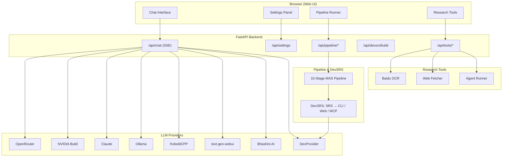

# Collabuild MAS v1.0

Collabuild MAS is a first-in-class, fully customisable **Multi-Agent System** that turns a research paper into a production-ready application — generating the Software Requirements Specification, module architecture, user flows, SDLC plan, code, debug review, deployment plan, and a GitHub-style README, then **materializing the SRS into a runnable CLI / FastAPI web / MCP application** with DevSRS.

It ships with a KoboldCPP-style chat UI for 8 LLM providers (local and cloud), Baidu Unlimited-OCR document parsing, an autonomous research agent with tool use, and full offline dev-mode fallback so the entire pipeline runs with zero API keys.

**Author:** [Sai Karun Nandipati](https://karun99.github.io)

[](https://github.com/karun99/Collabuild/actions/workflows/ci.yml)
[](https://www.python.org/downloads/)
[](LICENSE)

---

## Overview

Most AI pipelines stop at "generate some code." Collabuild MAS goes the full distance: a 10-stage multi-agent pipeline that ingests a research paper and produces SRS, architecture, user flows, a sprint plan, reviewed code, deployment infrastructure, a QA report, **and** an AgentNova-style project README. A dedicated component — **DevSRS** — then turns the drafted SRS into a genuinely runnable application.

Key design decisions:

- **Provider agnostic** — every OpenAI-compatible endpoint works, plus native integrations for Anthropic and Bhashini AI.
- **Offline capable** — `DevProvider` (offline mock) lets the full pipeline and DevSRS run with no network and no keys.
- **Extensible** — add providers, pipeline stages, research tools, or new DevSRS targets with minimal code.
- **Generative + deterministic** — LLM drafting for content, deterministic templating for the runnable DevSRS apps.

---

## Key Features

- **10-Stage MAS Pipeline** — Paper Analysis → SRS → Module Design → User Flow → SDLC Plan → Code Generation → Debug & Review → Deployment Plan → Final Review → Project README.
- **DevSRS — SRS → Runnable App** — builds a working **CLI**, **FastAPI web**, or **MCP server** from the drafted SRS, with a LangChain/AutoGen-inspired planner/executor agent layer and automatic smoke tests.
- **8 LLM Providers** — OpenRouter, NVIDIA Build, Anthropic Claude, Ollama, KoboldCPP, text-generation-webui, Bhashini AI (भाषिणी), and any OpenAI-compatible endpoint.
- **KoboldCPP-style Web UI** — streaming chat (SSE), settings panel, model discovery, pipeline runner with live progress, research tools, and a DevSRS builder.
- **Baidu Unlimited-OCR** — one-shot long-horizon document parsing (Unlimited-OCR, General OCR, Web Image OCR, Table OCR) for research input.
- **Autonomous Research Agent** — web fetching, OCR, and tool-use loop with step-by-step reasoning.
- **Mermaid Diagrams Everywhere** — every pipeline stage emits Mermaid (flowcharts, sequence, class, gantt, deployment).
- **Full Offline Dev Mode** — `--dev` runs the entire pipeline and DevSRS using built-in templates.

---

## Architecture

```
Browser (Web UI: Chat / Settings / Pipeline / Tools)
        │  SSE + JSON API
        ▼
FastAPI Backend (collabuild/web/app.py)
  /api/chat  /api/settings  /api/models  /api/local-models
  /api/pipeline/*  /api/devsrs/build  /api/tools/*
        │
        ├──────────────┬────────────────┬───────────────────────┐
        ▼              ▼                ▼                       ▼
   LLM Providers  Baidu OCR     Research Agent           Multi-Agent Pipeline
  (8 providers)  (4 OCR modes)  (fetch/OCR/tools)       (10 stages + DevSRS)
```



All 14 architecture diagrams are in [UML.md](UML.md).

---

## Technology Stack

- **Core Language:** Python 3.10+
- **Web Framework:** FastAPI, Uvicorn, Jinja2, SSE-Starlette
- **Agent Framework:** Custom MAS (`Agent`, `Crew`, `Task`) inspired by CrewAI/LangChain patterns
- **LLM Providers:** OpenRouter, NVIDIA Build, Anthropic Claude, Ollama, KoboldCPP, text-generation-webui, Bhashini AI, OpenAI-compatible
- **OCR:** Baidu OCR SDK (Unlimited-OCR + General + Web Image + Table)
- **DevSRS Targets:** Python CLI (argparse), FastAPI web app, MCP (Model Context Protocol) server
- **Config:** YAML with `${ENV_VAR}` substitution
- **CI/CD:** GitHub Actions, Docker, Docker Compose
- **Quality:** pytest (63 tests), ruff lint

---

## Installation

### Prerequisites

- **Python 3.10+**
- **pip**
- **Git**

### From Source (Recommended)

```bash
git clone https://github.com/karun99/Collabuild.git
cd Collabuild

python3 -m venv .venv
source .venv/bin/activate        # Linux / macOS
# .venv\Scripts\activate         # Windows

pip install -e ".[web,dev,all]"
```

### Docker

```bash
docker build -t collabuild-mas .

cp .env.example .env              # Set your API keys in .env
docker compose up -d              # or: docker run -p 8080:8080 -e OPENROUTER_API_KEY=sk-or-... collabuild-mas
```

### Quick Verify

```bash
python3 -c "import collabuild; print(collabuild.__version__)"   # 1.0.0

pytest tests/ -q                  # 63 passed
ruff check collabuild/ tests/     # All checks passed
```

---

## Quick Start

### 1. Launch the Web UI

```bash
collabuild web                    # default: http://127.0.0.1:8080
collabuild web --dev              # offline dev mode (no API key needed)
collabuild web --port 3000        # custom port
collabuild web --host 0.0.0.0     # bind all interfaces
```

### 2. Pick a Provider

| Provider | What you need | Free Tier |
|----------|--------------|-----------|
| **OpenRouter** | API key from [openrouter.ai](https://openrouter.ai) | Yes |
| **NVIDIA Build** | API key from [build.nvidia.com](https://build.nvidia.com) | Yes |
| **Claude** | API key from [console.anthropic.com](https://console.anthropic.com) | No |
| **Ollama** | `ollama serve` locally (auto-detected) | Yes (local) |
| **KoboldCPP** | KoboldCPP server locally (port 5001) | Yes (local) |
| **text-gen-webui** | oobabooga locally (port 5000) | Yes (local) |
| **Bhashini AI** | API key from [bhashini.gov.in](https://bhashini.gov.in/ulca/user/signup) | Yes (Indian languages) |
| **Dev** | No API key needed (offline mock) | Yes |

### 3. Run the Pipeline (CLI)

```bash
# Offline demo — 10 stages, writes pipeline_report.md, README.md, SRS.md
collabuild --dev

# With a real provider
collabuild --provider openrouter --paper-file paper.txt
collabuild --provider ollama --model llama3.1 --paper "My paper..."
collabuild --provider nvidia --api-key $NVIDIA_API_KEY --paper "My paper..."

# Write artifacts to a directory + build the app from the SRS
collabuild --dev --output-dir ./out --build --target web --app-dir generated_app
```

### 4. Build an App from an SRS (DevSRS)

```bash
collabuild devsrs --dev --target cli --srs-file SRS.md --output generated_app
cd generated_app && python main.py --list
python main.py document_upload_module --args '{"file": "a.pdf"}'
# → {"ok": true, "feature": "Document Upload Module", "result": "[Document Upload Module] executed"}
```

DevSRS targets: `cli` (argparse CLI), `web` (FastAPI + static UI, `uvicorn main:app`), `mcp` (JSON-RPC `tools/list` / `tools/call` over stdio). Each build ships `core.py` (capability registry), `agents.py` (planner/executor layer), entrypoint, `tests/`, `requirements.txt`, `.env.example`, `Dockerfile`, and `README.md` — with automatic smoke tests.

### 5. Research Tools

Use the web UI's Tools page or the API: Baidu OCR document parsing (`/api/tools/ocr`), URL fetching (`/api/tools/web-fetch`), and the autonomous agent runner (`/api/tools/agent-run`).

---

## Configuration

### Environment Variables

```bash
cp .env.example .env
```

| Variable | Provider | Description |
|----------|----------|-------------|
| `OPENROUTER_API_KEY` | OpenRouter | API key |
| `NVIDIA_API_KEY` | NVIDIA Build | API key |
| `ANTHROPIC_API_KEY` | Claude | API key |
| `BHASHINI_API_KEY` | Bhashini AI | API key |
| `BAIDU_OCR_API_KEY` | Baidu OCR | API key |
| `BAIDU_OCR_SECRET_KEY` | Baidu OCR | Secret key |

### config.yaml

Located at the project root. Defines provider defaults, the 10 pipeline stages (agent, temperature, description), OCR settings, web-fetcher timeouts, agent-runner limits, model search paths, chat defaults, and the `devsrs` target (`cli`/`web`/`mcp`). Supports `${ENV_VAR}` substitution.

### Pipeline Stages

| # | Stage | Agent | Description |
|---|-------|-------|-------------|
| 1 | Paper Analysis | PaperAnalyzer | Extract methodology, algorithms, architecture |
| 2 | SRS Generation | SRSGenerator | IEEE 830 Software Requirements Specification |
| 3 | Module Design | ModuleDesigner | Module decomposition with interfaces |
| 4 | User Flow Design | UserFlowDesigner | UX flows with sequence diagrams |
| 5 | SDLC Plan | SDLCPlanner | Sprint breakdown, milestones, timeline |
| 6 | Code Generation | CodeGenerator | Production-ready implementation code |
| 7 | Debugging & Review | Debugger | Bug/security/performance review |
| 8 | Deployment Plan | DeploymentPlanner | Infrastructure, CI/CD, monitoring |
| 9 | Final Review | FinalReviewer | QA validation |
| 10 | Project README | ReadmeGenerator | AgentNova/GitHub-style project README |

---

## API Reference

### Chat & Settings

| Endpoint | Method | Description |
|----------|--------|-------------|
| `/api/chat` | POST | Streaming chat (SSE) |
| `/api/chat/sync` | POST | Non-streaming chat |
| `/api/settings` | GET/POST | Get/save settings |
| `/api/models` | GET | List provider models |
| `/api/local-models` | GET | Scan for `.gguf`/`.ggml` files |
| `/api/providers/status` | GET | Check local provider status |

### Pipeline & DevSRS

| Endpoint | Method | Description |
|----------|--------|-------------|
| `/api/pipeline/run` | POST | Start pipeline run |
| `/api/pipeline/{run_id}` | GET | Get run status |
| `/api/pipeline/{run_id}/stream` | GET | SSE progress stream |
| `/api/devsrs/build` | POST | Build an app from an SRS document (cli/web/mcp) |

### Research Tools

| Endpoint | Method | Description |
|----------|--------|-------------|
| `/api/tools/status` | GET | Status of all research tools |
| `/api/tools/ocr` | POST | OCR a document via Baidu |
| `/api/tools/web-fetch` | POST | Fetch URL content |
| `/api/tools/agent-run` | POST | Run autonomous research agent |

---

## Deployment

### Docker Compose (Recommended)

```bash
cp .env.example .env        # add your API keys
docker compose up -d
```

### Manual

```bash
pip install -e ".[web]"
collabuild web --host 0.0.0.0 --port 8080
```

### CI/CD

Push to `main` or create a version tag to trigger GitHub Actions:

```bash
git tag v1.0.0
git push origin v1.0.0      # Triggers PyPI publish
```

---

## Security

- **API keys** are read from environment variables / `.env` — never hardcoded, never committed.
- **No secrets in generated code** — DevSRS apps ship `.env.example` placeholders only.
- Standard supply-chain practices: pinned CI workflows, MIT-licensed open source, and an up-to-date `SECURITY.md` policy for reporting vulnerabilities.
- Local-only providers (Ollama, KoboldCPP, textgen) bind to localhost by default; bind `0.0.0.0` only inside trusted networks.

---

## Performance

- **Full 10-stage pipeline offline:** < 1 second with `DevProvider`.
- **DevSRS build:** each cli/web/mcp target compiles, smoke-tests, and returns in seconds.
- **Streaming chat:** token-by-token SSE from cloud and local providers.
- **Baidu Unlimited-OCR:** one-shot long-horizon parsing with up to 200 pages/personal, 1000 pages/enterprise free tiers.

---

## Roadmap

- [x] 10-stage MAS pipeline with Mermaid outputs and `write_artifacts()`
- [x] DevSRS: SRS → CLI / FastAPI web / MCP builder with smoke tests
- [x] 8 LLM providers + full offline dev mode
- [x] Baidu Unlimited-OCR + autonomous research agent
- [ ] Additional DevSRS targets (e.g., REST microservice, JS/TS SDK)
- [ ] Plug-in pipeline stages via config
- [ ] Evaluate generated code against a test harness at build time
- [ ] PyPI release automation and model eval benchmark suite

---

## Contributing

1. Fork the repository.
2. Create a feature branch: `git checkout -b feat/your-feature`.
3. Commit changes: `git commit -am "feat: add your feature"`.
4. Push: `git push origin feat/your-feature`.
5. Open a Pull Request.

See [CONTRIBUTING.md](CONTRIBUTING.md) and [CODE_OF_CONDUCT.md](CODE_OF_CONDUCT.md).

---

## Author

**Sai Karun Nandipati**
- Website: [https://karun99.github.io](https://karun99.github.io)
- GitHub: [https://github.com/karun99/Collabuild](https://github.com/karun99/Collabuild)

---

## License

MIT License — see [LICENSE](LICENSE) for details.
