# Collabuild MAS — UML Diagrams

All diagrams are in [Mermaid](https://mermaid-js.github.io/) format. Render at [mermaid.live](https://mermaid.live) or in any Mermaid-compatible viewer.

---

## 1. System Architecture

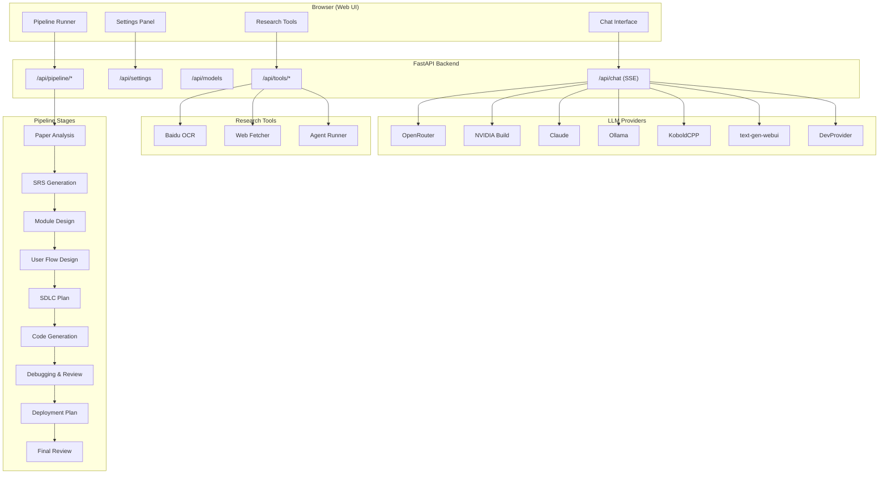

---

## 2. Provider Class Hierarchy

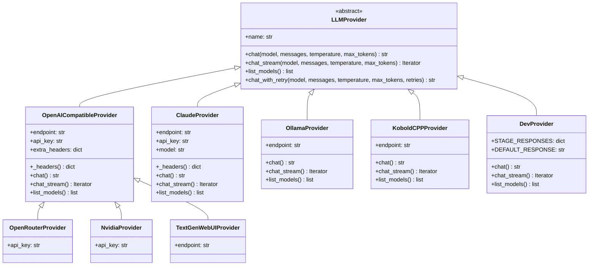

---

## 3. 10-Stage Pipeline Flow

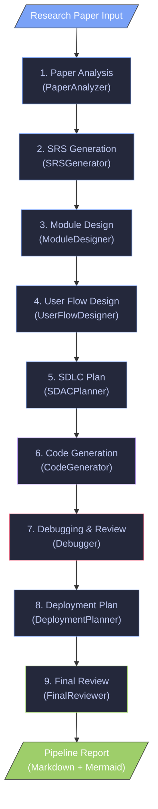

---

## 4. Chat API Sequence Diagram

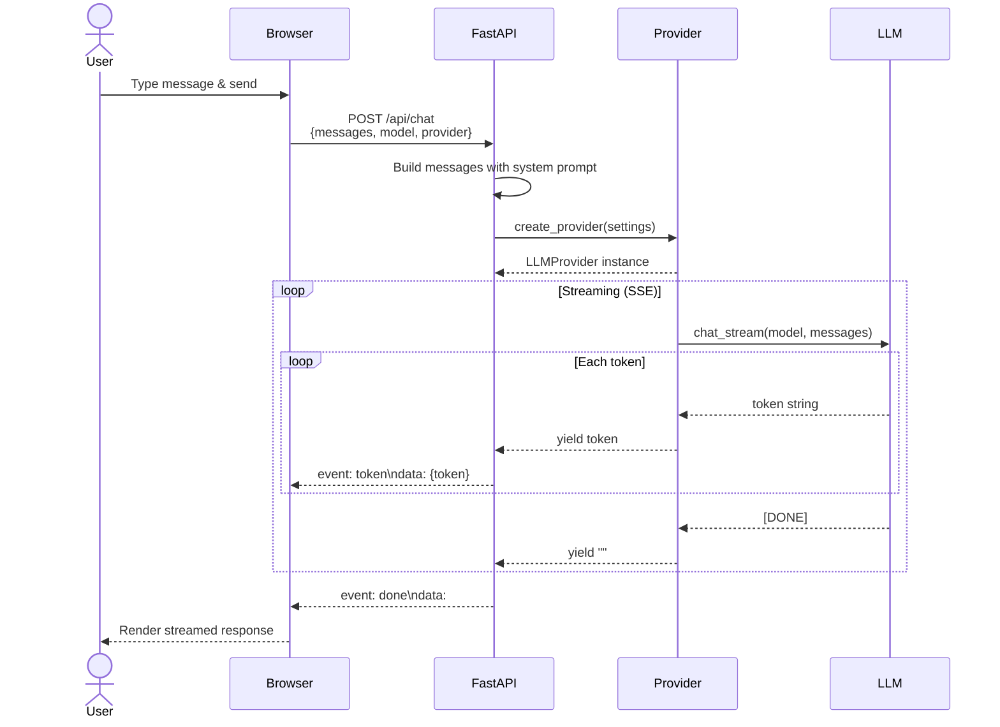

---

## 5. Provider Selection Sequence

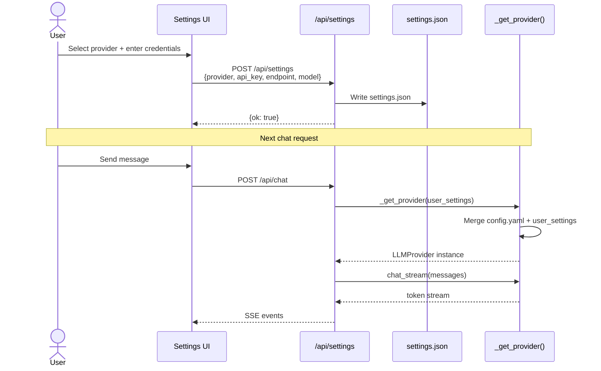

---

## 6. Multi-Agent System (MAS) Class Diagram

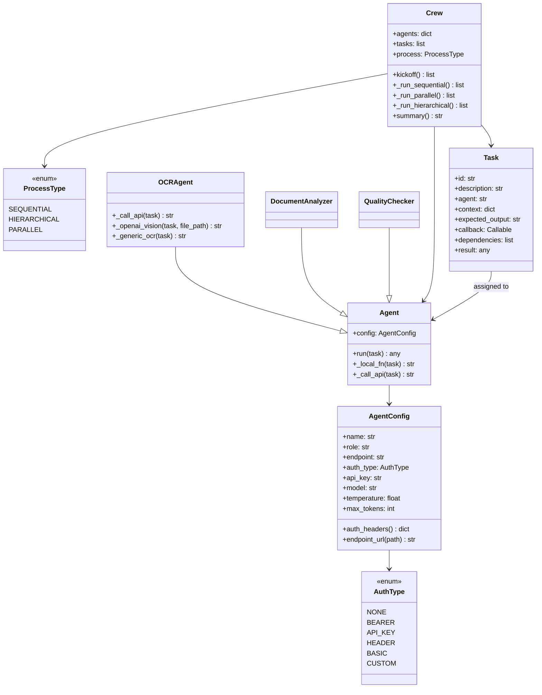

---

## 7. Pipeline Stage Agent Flow

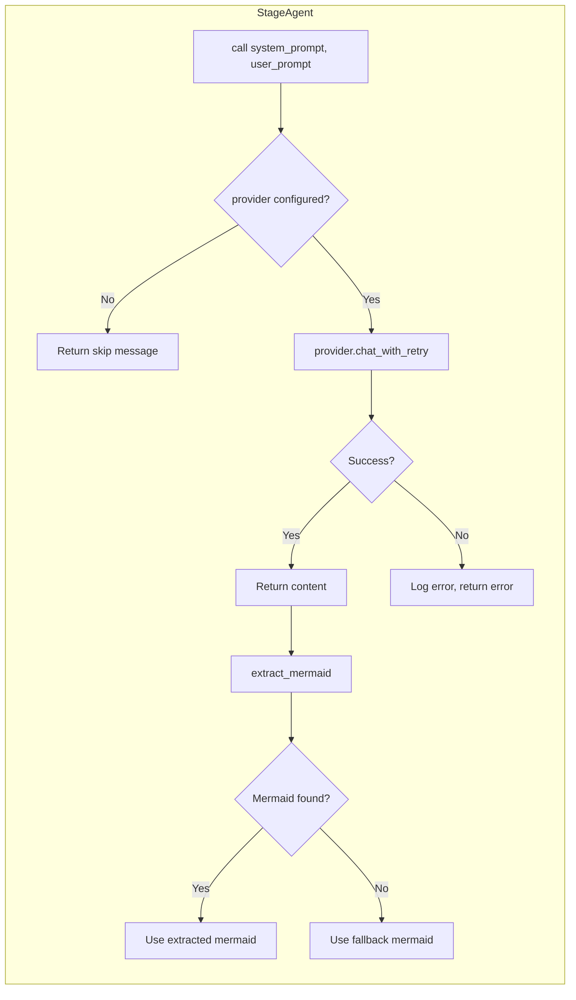

---

## 8. Web Application Deployment

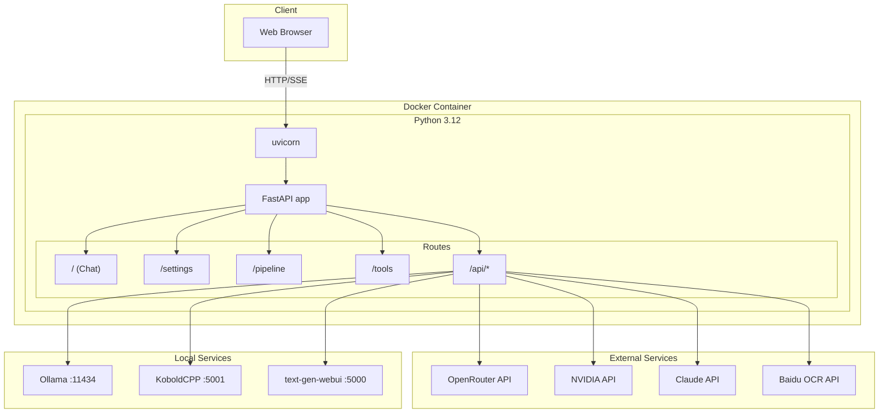

---

## 9. Research Agent Loop

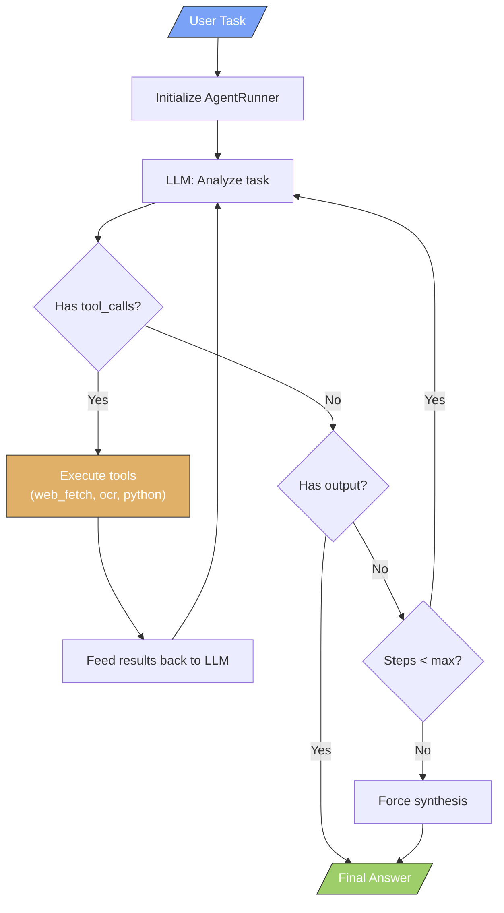

---

## 10. Data Flow — OCR Document Processing

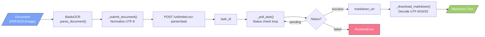

---

## 11. Configuration Resolution

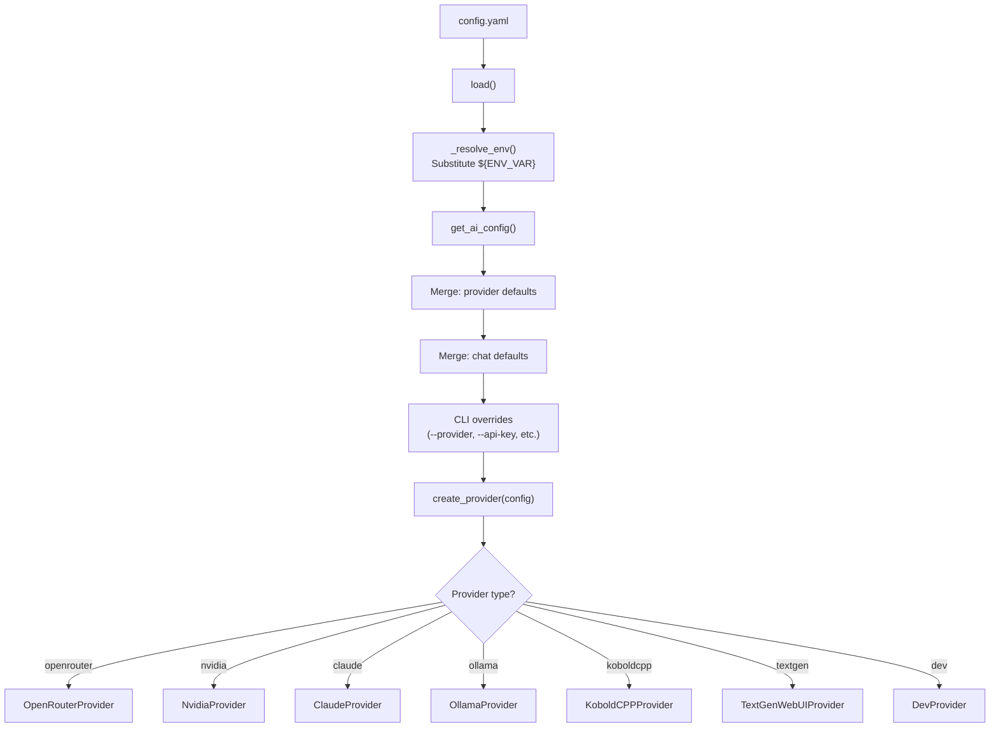

---

## 12. CI/CD Pipeline

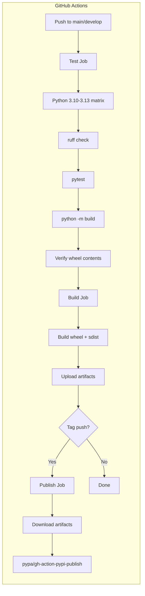

---

## 13. Module Decomposition

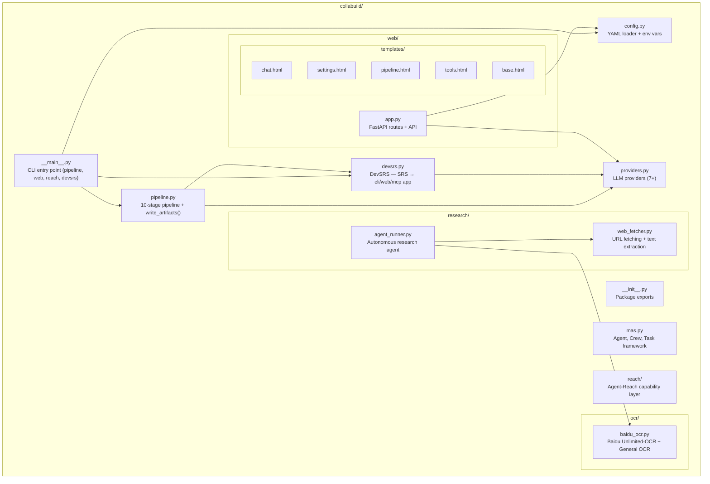

---

## 14. DevSRS Build Flow

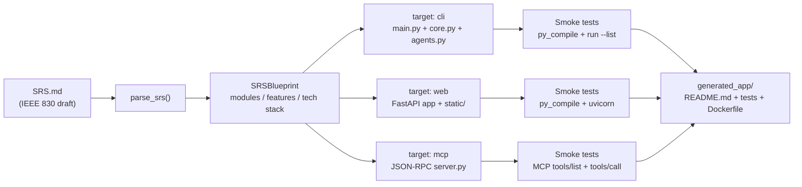

---

## Rendering

To render these diagrams:

1. **Online:** Copy any ```mermaid block into [mermaid.live](https://mermaid.live)
2. **VS Code:** Install the "Mermaid Preview" extension
3. **GitHub:** Markdown files with Mermaid blocks render automatically on GitHub
4. **CLI:** Use `mmdc` (Mermaid CLI):
   ```bash
   npm install -g @mermaid-js/mermaid-cli
   mmdc -i diagram.mmd -o diagram.svg
   ```
