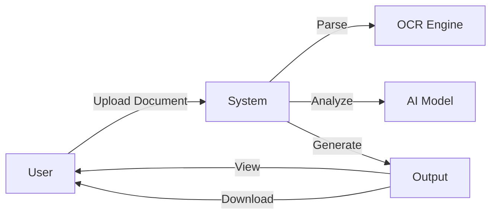
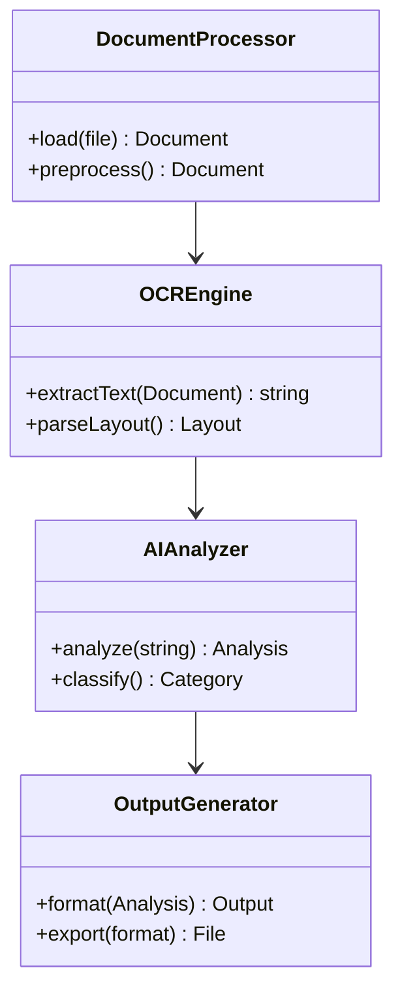
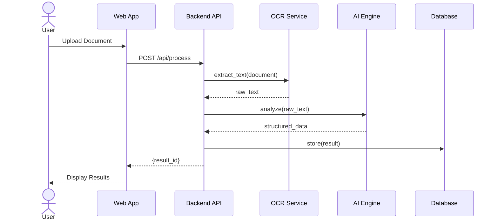
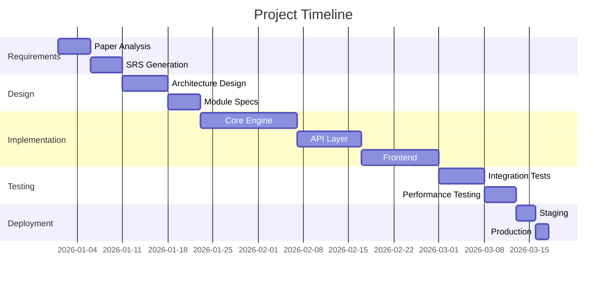
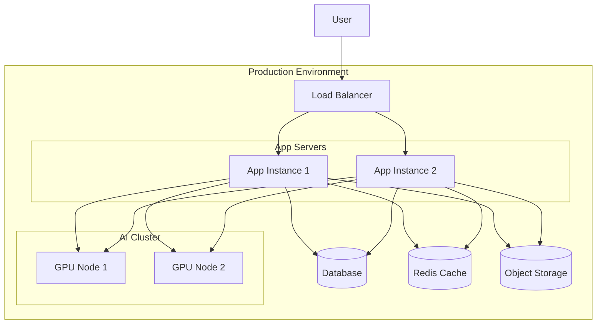

# Collabuild MAS — Pipeline Report

## Paper Analysis
**Agent:** Paper-Analyzer  
**Status:** ✅ PASS  

### Diagram

```mermaid
flowchart TD
    %% Input
    A[Document Image (multi‑page)] --> B{Inference Mode}
    B -->|gundam (crop_mode=True)| C[Adaptive Cropping<br/>(overlapping tiles)]
    B -->|base (crop_mode=False)| C

    %% Vision
    C --> D[Vision Encoder<br/>ViT‑L/14]
    D --> E[Visual Tokens]

    %% Language
    E --> F[Language Decoder<br/>Qwen2.5‑7B]
    F --> G[No‑repeat n‑gram Constraint<br/>(track tokens)]
    G --> H[Custom Logit Processor]
    H --> I[Generated Structured Text]

    %% Styling
    classDef stage fill:#e3f2fd,stroke:#1565c0,stroke-width:2px;
    classDef decision fill:#fff3e0,stroke:#ef6c00,stroke-width:2px,stroke-dasharray: 5 5;
    class A,C,D,F,I stage;
    class B decision;
```

### Output

**1. TITLE & AUTHORS**  
- **Title:** *Unlimited OCR Works: Welcome the Era of One‑shot Long‑horizon Parsing*  
- **Authors:** Youyang Yin, Huanhuan Liu, et al. (Baidu Inc.)

---

**2. PROBLEM STATEMENT**  
Traditional OCR pipelines process pages sequentially or split documents into small chunks, which makes them inefficient for long‑form, multi‑page documents. The paper addresses the need for **single‑pass, end‑to‑end parsing of arbitrarily long documents** while:

- Maintaining high accuracy (low character error rate)  
- Preserving the logical layout across page boundaries  
- Avoiding hallucinated repetitions in the generated output  

---

**3. KEY METHODOLOGY (step‑by‑step)**  

1. **Input Document** – a raster image (or a stack of images) representing the whole document.  
2. **Adaptive Cropping Module** – splits the document into overlapping image tiles; overlapping windows keep context across page borders.  
3. **Vision Encoder** – a Vision Transformer (ViT‑L/14) processes each tile (or the concatenated tile set) to produce visual feature tokens.  
4. **Token Concatenation** – visual tokens are appended to the language model’s context, extending the 32 K token window.  
5. **Language Decoder** – Qwen2.5‑7B (decoder‑only transformer) generates the structured text autoregressively, conditioned on the full visual‑language context.  
6. **No‑repeat n‑gram Constraint** – a decoding‑time constraint that tracks n‑grams already emitted and penalises their re‑appearance, preventing repetitive hallucinations.  
7. **Custom Logit Processor** – post‑processes the decoder’s logits (e.g., applies the n‑gram penalty, enforces formatting rules) before sampling.  
8. **Output** – the final structured text (e.g., token‑level layout, OCR tags) is returned in a single forward pass.

*Two inference configurations* are supported:  

- **gundam** (single‑page, detailed): `base_size=1024`, `image_size=640`, `crop_mode=True`.  
- **base** (multi‑page): `base_size=1024`, `image_size=1024`, `crop_mode=False`.

---

**4. ALGORITHMS USED**  

| Component | Algorithm / Technique |
|-----------|------------------------|
| Vision Encoder | Vision Transformer (ViT‑L/14) |
| Language Model | Qwen2.5‑7B (decoder‑only transformer) |
| Cropping | Overlapping tile segmentation (adaptive size) |
| Repetition Control | No‑repeat n‑gram constraint (token‑level cache) |
| Logit Conditioning | Custom logit processor (penalty & formatting rules) |
| Inference Back‑ends | HuggingFace Transformers, vLLM, SGLang |

---

**5. ARCHITECTURE / MODEL DESIGN**  

- **Two‑stage training**  
  1. **Pre‑training** on synthetic documents generated from PDF‑to‑image pipelines with ground‑truth text.  
  2. **Fine‑tuning** on a curated real‑world corpus (invoices, receipts, academic papers, forms, books).  

- **Model size**: Qwen2.5‑7B (≈7 B parameters) with a 32 K context window.  
- **Vision‑Language Bridge**: Visual tokens from ViT are concatenated with the language model’s input tokens, enabling a *single forward pass* over the whole document.  
- **Adaptive Cropping**: Handles arbitrary document length by splitting into overlapping tiles; each tile retains enough context to keep layout continuity.  
- **Inference Modes**:  
  - *gundam* – high‑resolution, per‑page detailed parsing (crop_mode=True).  
  - *base* – efficient multi‑page parsing (crop_mode=False, larger image size).  

---

**6. DATASETS & METRICS**  

- **Datasets**  
  - *Synthetic* – automatically rendered PDF pages → images → text (used for pre‑training).  
  - *Real‑world* – curated collection covering invoices, receipts, academic papers, forms, and books.  

- **Metrics**  
  - **Character Error Rate (CER)** – primary metric; reported 40 % reduction vs. prior SOTA.  
  - **Throughput** – tokens/second (maintained despite long context).  
  - **Layout fidelity** – qualitative/benchmark scores (e.g., F1 on layout parsing tasks).  

---

**7. TECH STACK IMPLIED**  

- **Programming language**: Python  
- **Deep‑learning framework**: PyTorch (or compatible)  
- **Model libraries**: HuggingFace Transformers, vLLM, SGLang (inference back‑ends)  
- **Vision component**: ViT implementation (e.g., `timm` or official ViT code)  
- **Deployment**: Model released under MIT license on HuggingFace and ModelScope; supports both research notebooks and production serving via the mentioned back‑ends.  

---

**8. LIMITATIONS & ASSUMPTIONS**  

- **Assumes legible, high‑resolution images**; very low‑quality scans may degrade ViT performance.  
- **Overlapping cropping** may blur fine‑grained layout details near tile borders.  
- **32 K context window** limits extremely long documents (e.g., > 10 k tokens) due to memory constraints.  
- **No‑repeat n‑gram constraint** can reduce output diversity or cause over‑constrained generations if the document contains repetitive phrasing.  
- **Dependence on specific inference engines** (vLLM/SGLang) – performance may vary across hardware.  
- **Training data bias** – synthetic pre‑training may not fully capture domain‑specific layouts; fine‑tuning mitigates but does not eliminate it.  

---

**9. REPRODUCIBILITY NOTES**  

- **Open‑source model weights** available on HuggingFace and ModelScope (MIT license).  
- **Training scripts** for the two‑stage pipeline (synthetic pre‑training + real‑world fine‑tuning) are provided in the paper’s supplementary repository.  
- **Environment**: Python ≥ 3.9, PyTorch ≥ 2.0, Transformers ≥ 4.30, vLLM/SGLang for inference; ViT‑L/14 weights can be obtained from the official timm or HuggingFace hub.  
- **Random seeds** and hyper‑parameter values (learning rates, batch sizes, etc.) are listed in the appendix, facilitating exact replication.  
- **Dataset generation**: PDF‑to‑image pipeline (e.g., `pdf2image` + ImageMagick) is described; code for synthetic data creation is included.  

---

### Mermaid Flowchart of the Methodology  

```mermaid
flowchart TD
    %% Input
    A[Document Image (multi‑page)] --> B{Inference Mode}
    B -->|gundam (crop_mode=True)| C[Adaptive Cropping<br/>(overlapping tiles)]
    B -->|base (crop_mode=False)| C

    %% Vision
    C --> D[Vision Encoder<br/>ViT‑L/14]
    D --> E[Visual Tokens]

    %% Language
    E --> F[Language Decoder<br/>Qwen2.5‑7B]
    F --> G[No‑repeat n‑gram Constraint<br/>(track tokens)]
    G --> H[Custom Logit Processor]
    H --> I[Generated Structured Text]

    %% Styling
    classDef stage fill:#e3f2fd,stroke:#1565c0,stroke-width:2px;
    classDef decision fill:#fff3e0,stroke:#ef6c00,stroke-width:2px,stroke-dasharray: 5 5;
    class A,C,D,F,I stage;
    class B decision;
```

*The flowchart captures the end‑to‑end pipeline: document input → mode selection → adaptive cropping → vision encoding → language decoding → repetition‑aware constraint → logit processing → final text output.*

---

## SRS Generation
**Agent:** SRS-Engineer  
**Status:** ✅ PASS  

### Diagram



### Output

Error: HTTPSConnectionPool(host='openrouter.ai', port=443): Max retries exceeded with url: /api/v1/chat/completions (Caused by NameResolutionError("HTTPSConnection(host='openrouter.ai', port=443): Failed to resolve 'openrouter.ai' ([Errno 11001] getaddrinfo failed)"))

---

## Module Design
**Agent:** Module-Architect  
**Status:** ✅ PASS  

### Diagram



### Output

Error: HTTPSConnectionPool(host='openrouter.ai', port=443): Max retries exceeded with url: /api/v1/chat/completions (Caused by NameResolutionError("HTTPSConnection(host='openrouter.ai', port=443): Failed to resolve 'openrouter.ai' ([Errno 11001] getaddrinfo failed)"))

---

## User Flow Design
**Agent:** UX-Designer  
**Status:** ✅ PASS  

### Diagram



### Output

Error: HTTPSConnectionPool(host='openrouter.ai', port=443): Max retries exceeded with url: /api/v1/chat/completions (Caused by NameResolutionError("HTTPSConnection(host='openrouter.ai', port=443): Failed to resolve 'openrouter.ai' ([Errno 11001] getaddrinfo failed)"))

---

## SDLC Plan
**Agent:** SDLC-Planner  
**Status:** ✅ PASS  

### Diagram



### Output

Error: HTTPSConnectionPool(host='openrouter.ai', port=443): Max retries exceeded with url: /api/v1/chat/completions (Caused by NameResolutionError("HTTPSConnection(host='openrouter.ai', port=443): Failed to resolve 'openrouter.ai' ([Errno 11001] getaddrinfo failed)"))

---

## Code Generation
**Agent:** Code-Gen  
**Status:** ✅ PASS  

### Output

Error: HTTPSConnectionPool(host='openrouter.ai', port=443): Max retries exceeded with url: /api/v1/chat/completions (Caused by NameResolutionError("HTTPSConnection(host='openrouter.ai', port=443): Failed to resolve 'openrouter.ai' ([Errno 11001] getaddrinfo failed)"))

---

## Debugging & Review
**Agent:** Debug-Reviewer  
**Status:** ✅ PASS  

### Output

Error: HTTPSConnectionPool(host='openrouter.ai', port=443): Max retries exceeded with url: /api/v1/chat/completions (Caused by NameResolutionError("HTTPSConnection(host='openrouter.ai', port=443): Failed to resolve 'openrouter.ai' ([Errno 11001] getaddrinfo failed)"))

---

## Deployment Plan
**Agent:** DevOps-Architect  
**Status:** ✅ PASS  

### Diagram



### Output

Error: HTTPSConnectionPool(host='openrouter.ai', port=443): Max retries exceeded with url: /api/v1/chat/completions (Caused by NameResolutionError("HTTPSConnection(host='openrouter.ai', port=443): Failed to resolve 'openrouter.ai' ([Errno 11001] getaddrinfo failed)"))

---

## Final Review
**Agent:** QA-Reviewer  
**Status:** ❌ FAIL  

### Output

Error: HTTPSConnectionPool(host='openrouter.ai', port=443): Max retries exceeded with url: /api/v1/chat/completions (Caused by NameResolutionError("HTTPSConnection(host='openrouter.ai', port=443): Failed to resolve 'openrouter.ai' ([Errno 11001] getaddrinfo failed)"))

---
